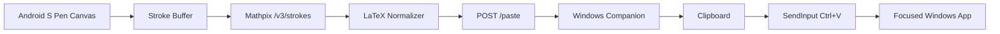

# Mathwrite Handwriting-to-LaTeX Design

## Goal

Build a system where a Samsung Tab S8+ acts as a handwriting input pad for LaTeX. When the tablet is connected to a Windows laptop over USB, handwritten math is converted into LaTeX and automatically pasted into the laptop application that currently has text focus.

## MVP Decision

Use Mathpix stroke recognition for the first implementation because it is the fastest reliable path to a working prototype. The app will capture S Pen strokes on Android, send those strokes to Mathpix's `/v3/strokes` API, and send the returned LaTeX to a Windows companion app through an `adb reverse` USB tunnel. The Windows companion will set the clipboard and issue a paste command with Win32 input injection.

MyScript iink remains the preferred later recognition engine if offline recognition, lower recurring cloud dependency, or a more polished product workflow becomes more important than initial implementation speed.

## Scope

The first version supports:

- A full-screen Android ink canvas optimized for S Pen writing.
- Manual conversion and paste using a Send button.
- Optional auto-send after a short idle delay once recognition is reliable.
- Mathpix stroke recognition using raw stroke coordinates.
- A Windows companion with a local HTTP endpoint.
- Automatic USB bridge setup using `adb reverse tcp:18765 tcp:18765`.
- Clipboard paste into the current focused Windows application.
- Paste formatting modes: raw LaTeX, inline math, display math.
- Basic status and error reporting on both Android and Windows.

The first version does not support:

- Offline recognition.
- A custom USB driver.
- Rich editor integration with app-specific APIs.
- Bidirectional document synchronization.
- Multi-device pairing.
- Background Android recognition when the app is not visible.

## Architecture

The system has two applications.

The Android tablet app owns handwriting capture and recognition. It provides a low-latency drawing surface, stores strokes as arrays of x/y points, submits them to Mathpix, normalizes the returned LaTeX, and posts a paste request to `http://127.0.0.1:18765/paste`.

The Windows companion owns device bridging and paste injection. It runs a small local HTTP server on `127.0.0.1:18765`, maintains the `adb reverse` mapping while a device is connected, receives LaTeX payloads, writes the selected output format to the clipboard, and sends `Ctrl+V` to the active foreground app.



## Android App

The Android app should be built with Kotlin and Jetpack Compose. Pointer input is captured from stylus events and converted into Mathpix-compatible stroke arrays:

- Each pen-down to pen-up gesture becomes one stroke.
- Each stroke stores x and y arrays with matching lengths.
- Coordinates are normalized into the canvas coordinate space used for recognition.
- The app keeps the latest recognized LaTeX visible before sending.

Primary screens:

- Write screen: canvas, recognition preview, send button, clear button, undo stroke button, mode selector.
- Settings screen: Mathpix app id/key or app-token endpoint, paste mode, idle auto-send delay, companion port.

Recognition flow:

1. User writes on the tablet.
2. User taps Send, or auto-send triggers after the configured idle delay.
3. App sends stroke data to Mathpix.
4. App extracts `latex_styled` when available; otherwise it falls back to the LaTeX item in response data.
5. App formats the LaTeX according to the selected paste mode.
6. App posts the formatted text to the Windows companion.
7. App shows success, connection failure, or recognition failure.

## Windows Companion

The Windows companion should be built in C# on modern .NET. A tray-first app is preferable because the user usually wants it to stay out of the way while writing into other applications.

Responsibilities:

- Start local HTTP server on `127.0.0.1:18765`.
- Expose `POST /paste` with a JSON body containing `latex`, `mode`, and `sequenceId`.
- Run `adb devices` periodically or subscribe to device-state changes if available.
- Apply `adb reverse tcp:18765 tcp:18765` for the selected connected tablet.
- Write paste text to the Windows clipboard.
- Send `Ctrl+V` with `SendInput`.
- Optionally restore the previous clipboard value after a configurable delay.
- Log recent paste requests and failures in a small diagnostics window.

Paste behavior:

- The companion pastes only after a valid local request.
- Requests must include a monotonically increasing `sequenceId` to avoid duplicate paste on retry.
- The local HTTP server binds only to loopback.
- No network listener should be exposed to the LAN.

## Data Contracts

Android to Windows:

```json
{
  "sequenceId": 42,
  "latex": "\\frac{x^2+1}{2}",
  "mode": "inline",
  "source": "mathwrite-android"
}
```

Windows response:

```json
{
  "ok": true,
  "pasted": true,
  "sequenceId": 42
}
```

Failure response:

```json
{
  "ok": false,
  "pasted": false,
  "sequenceId": 42,
  "errorCode": "clipboard_busy",
  "message": "The Windows clipboard was busy. Try again."
}
```

Paste modes:

- `raw`: `\frac{x^2+1}{2}`
- `inline`: `\(\frac{x^2+1}{2}\)`
- `dollarInline`: `$\frac{x^2+1}{2}$`
- `display`: `\[\frac{x^2+1}{2}\]`

## Error Handling

Android should handle:

- Mathpix credentials missing or invalid.
- Network unavailable.
- Mathpix timeout.
- Low recognition confidence.
- Windows companion unreachable.
- USB bridge absent.

Windows should handle:

- No Android device connected.
- Multiple Android devices connected.
- `adb` missing from PATH and no configured Android SDK path.
- Port 18765 already in use.
- Clipboard busy.
- `SendInput` blocked by Windows integrity-level restrictions.
- Duplicate sequence ids.

User-facing failures should be short and actionable. Diagnostic details belong in logs, not in the main writing surface.

## Security And Privacy

The MVP sends handwriting strokes to Mathpix, so it is not fully private or offline. The app must make that explicit in settings. Mathpix credentials should not be hardcoded into source code; development builds can use local configuration, while later builds should use short-lived app tokens issued by a small user-owned backend or local companion.

The Windows listener must bind to `127.0.0.1` only. The USB bridge should use `adb reverse`, not an open LAN socket. Clipboard contents should be restored only when the user enables that setting, because restoring can surprise users who expect the LaTeX to remain copied.

## Testing Strategy

Windows companion tests:

- Unit-test paste-mode formatting.
- Unit-test duplicate `sequenceId` handling.
- Unit-test request validation.
- Integration-test `/paste` with a fake paste executor.
- Manual smoke-test into Notepad and VS Code.

Android tests:

- Unit-test stroke serialization.
- Unit-test Mathpix response parsing.
- Unit-test paste-mode formatting parity with Windows.
- Instrumented test for canvas stroke capture.
- Manual smoke-test with S Pen on the Tab S8+.

End-to-end tests:

- Connect tablet over USB.
- Start Windows companion.
- Confirm `adb reverse` is active.
- Write `x^2 + y^2 = z^2`.
- Send to Windows.
- Verify focused editor receives the expected LaTeX.

## Delivery Phases

Phase 1: Windows paste bridge.

- Build companion HTTP server.
- Implement clipboard paste executor.
- Add fake request test path.
- Verify paste into Notepad and VS Code.

Phase 2: USB bridge automation.

- Detect `adb`.
- Detect connected tablet.
- Apply `adb reverse`.
- Show bridge status.

Phase 3: Android handwriting app.

- Build S Pen canvas.
- Store strokes.
- Add preview, clear, undo, and send controls.

Phase 4: Mathpix integration.

- Submit strokes.
- Parse LaTeX response.
- Display confidence/status.
- Send result to Windows companion.

Phase 5: Product polish.

- Add auto-send after idle.
- Add settings.
- Add clipboard restore option.
- Add diagnostics and retry behavior.

## Acceptance Criteria

The MVP is complete when:

- The Windows companion can receive a LaTeX payload over `POST /paste`.
- The companion pastes into the current focused app without requiring manual copy/paste.
- The companion automatically establishes `adb reverse` when the tablet is plugged in.
- The Android app captures S Pen strokes and converts them through Mathpix.
- Writing a simple expression on the tablet results in corresponding LaTeX appearing at the Windows cursor.
- Failure states are visible and do not silently drop input.
